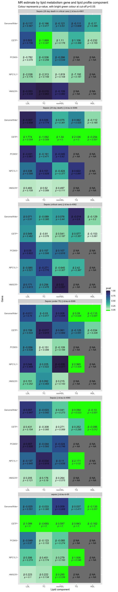

<style>
body{text-align: justify}
</style>

```{r init, include=FALSE}
knitr::opts_chunk$set(
  collapse = TRUE,
  comment  = "#>", 
  message  = FALSE,
  warning  = FALSE, 
  echo     = TRUE,
  eval     = FALSE,
  cache    = FALSE
)
```

## Installation
You can install the latest version of MRLipidInfection in R using:
```{r installation, eval = FALSE}
remotes::install_github("nicksunderland/MRLipidInfection")
```

## Setup MRLipidInfection package
First we need to load the MRLipidInfection package and setup package requirements by calling
`setupMRLipidInfection()`. At the first installation this will take some time as this will download
the [1000 genomes LD reference panel](http://fileserve.mrcieu.ac.uk/ld/1kg.v3.tgz) into the package
file structure and ensure that [PLINK](https://www.cog-genomics.org/plink/) is installed locally. If
you plan to use only the Bristol IEU servers for LD processing you can skip these downloads.

```{r setup, eval = TRUE}
library(MRLipidInfection)

setupMRLipidInfection(skip_local_download=TRUE)
```

## Configuration file
The column names in any given GWAS file may not be consistent with the `TwoSampleMR` package naming
conventions. `TwoSampleMR` provides the function `TwoSampleMR::format_data` to appropriately rename
the columns, as well as extra data checking and imputation processing. To configure this correctly
we need to provide a column mapping `config.yml` file to the constructor of this package's `GWAS`
class.  An example of the `config.yml` structure can be opened in `R` with the
`get_default_gwas_config()` command - a copy of this should be saved and adjusted as needed.

```{r config_file, eval = TRUE}
# File path to the config file; set open_file=TRUE to also open the file in RStudio
fp <- get_default_gwas_config(open_file=FALSE)
fp

# Set the config file for the GLGC GWAS data
config <- system.file("extdata/config/glgc_gwas.yml", package = "MRLipidInfection")
config

# View the structure of the default config file
knitr::kable(data.frame("old_name" = unname(unlist(yaml::read_yaml(fp))), 
                        "new_name" = names(yaml::read_yaml(fp))))
```

# Exposure data
## Lipid profile data
Next we must obtain the data for the exposure. We are interested whether exposure to lipid lowering
medications influences risk of developing sepsis. This exact data is not readily available on a
population level and has many confounding factors. We will therefore estimate the effect of
genetically proxied lipid medication therapy by looking for Single Nucleotide Polymorphisms (SNPs)
in close proximity to known lipid metabolism genes (HMG-CoA Reductase, NPC1L1, PCSK9, CETP) that are
significantly associated with circulating lipid levels.

We will use the the latest Global Lipids Genetics Consortium
[Ancestry-specific GWAS summary statistics](http://csg.sph.umich.edu/willer/public/glgc-lipids2021/)
for the lipid components: HDL-C, LDL-C, nonHDL-C, TC and TG. 

As we will be using sepsis outcome data from the UK BioBank we will use the data excluding the UK
BioBank to avoid overlap of the exposure and outcome populations.

```{r data_sources, eval = FALSE}
# List the URLs of the data sources
urls_lst <- list(
  "LDL"    = "http://csg.sph.umich.edu/willer/public/glgc-lipids2021/results/ancestry_specific/without_UKB_LDL_INV_EUR_HRC_1KGP3_others_ALL.meta.singlevar.results.gz",
  "HDL"    = "http://csg.sph.umich.edu/willer/public/glgc-lipids2021/results/ancestry_specific/without_UKB_HDL_INV_EUR_HRC_1KGP3_others_ALL.meta.singlevar.results.gz",
  "TC"     = "http://csg.sph.umich.edu/willer/public/glgc-lipids2021/results/ancestry_specific/without_UKB_TC_INV_EUR_HRC_1KGP3_others_ALL.meta.singlevar.results.gz",
  "nonHDL" = "http://csg.sph.umich.edu/willer/public/glgc-lipids2021/results/ancestry_specific/without_UKB_nonHDL_INV_EUR_HRC_1KGP3_others_ALL.meta.singlevar.results.gz",
  "TG"     = "http://csg.sph.umich.edu/willer/public/glgc-lipids2021/results/ancestry_specific/without_UKB_logTG_INV_EUR_HRC_1KGP3_others_ALL.meta.singlevar.results.gz"
)
```

We create a custom `GWAS` object for each lipid component. Internally, the GWAS object reads in the
data file provided through the parameter `file_path`. If `file_path` is a URL then the file is first
downloaded into the package downloads directory and extracted.

```{r show_gwas_obj, eval = TRUE}
##Example GWAS object
test_filepath <- system.file("testdata", "test_data.csv",   package="MRLipidInfection")
test_config   <- system.file("testdata", "test_config.yml", package="MRLipidInfection")
testGWAS      <- GWAS(file_path = test_filepath, 
                      config    = test_config, 
                      name      = "test", 
                      type      = "exposure")

## GWAS object structure
str(testGWAS)
```

**Warning** The GLGC GWAS data files are large and will take some time to download. However,
creating further `GWAS` objects with the same `file_path` will result in much quicker loading as the
class first checks whether the file has already been downloaded. There are more than 47 million SNPs
in the datasets. We need to filter the GWAS data SNPs associated with circulating lipid levels at a
statistical significance of `p<5e-8`. This threshold is passed to the `GWAS` object at
instantiation. Internally, the `GWAS` caches the filters SNPs to a .csv file within the package
structure. This is loaded instead if the command is re-run (behaviour that can be overridden by
passing `overwrite=TRUE` to the `GWAS` constructor).

```{r download_data, eval = FALSE}
# Create a list of GWAS objects using the GLGC data
lipids_gwas_lst <- purrr::map2(.x = unname(urls_lst),
                               .y = names(urls_lst), 
                               .f = ~GWAS(file_path = .x, 
                                          name      = .y,
                                          config    = config,
                                          type      = "exposure",
                                          sig_pval  = 5e-8))
```

## Cis-acting lipid metabolism gene SNPs
We will create a set of exposure SNPs that will be subset of the SNPs that associate with the 5
lipid components:  HDL-C, LDL-C, nonHDL-C, TC and TG. This subset of SNPs will be in close proximity
to the genes of interest (HMG-CoA Reductase, NPC1L1, PCSK9, CETP). Data regarding the positions of
the genes is available [online](https://www.genecards.org/cgi-bin/carddisp.pl?gene=HMGCR).

The latest lipid data from the GLGC uses the Genome Reference Consortium Human Reference 37 (GRCh37)
Assembly and so we must use this when referring to the position of the genes. 

First, we create a list of objects of class `GenomeRegion` - this is a simple custom S4 class
containing gene information. In addition, we will look at all of the SNPs across the whole genome
that associate with lipid profile components (set `genome_wide=TRUE`). Each `GWAS` object has an
internal slot for a `GenomeRegion` object from which it will determine the appropriate SNP filtering
(e.g. keeping only SNPs around a certain genome region / gene).

```{r genome_regions, eval = FALSE}
# The HMG-CoA-R, NPC1L1, and PCSK9 genes; set the 'cis' base tolerance here.
genome_regions_lst = list(
  GenomeRegion(name="HMGCR",  genome_wide=FALSE, chromosome=5,  start=74632993, end=74657941, cis_tol=1e5, clump_r2=0.2),
  GenomeRegion(name="NPC1L1", genome_wide=FALSE, chromosome=7,  start=44552134, end=44580929, cis_tol=1e5, clump_r2=0.2),
  GenomeRegion(name="PCSK9",  genome_wide=FALSE, chromosome=1,  start=55505221, end=55530525, cis_tol=1e5, clump_r2=0.2),
  GenomeRegion(name="CETP",   genome_wide=FALSE, chromosome=16, start=56995862, end=57017757, cis_tol=1e5, clump_r2=0.2),
  GenomeRegion(name="GenomeWide", genome_wide=TRUE, clump_r2=0.001)
)
```

Next we create exposure data for each lipid component `GWAS` and each `GenomeRegion`. Hence there
will be n = `length(lipids_gwas_lst)` x `length(genome_regions_list)` exposure datasets.

```{r generate_exposure_data, eval = FALSE}
# Create all the permutations of lipid components (#5) and genome regions (#5) = #25 datasets
lipid_gene_perms_lst <- purrr::map2(
  .x = rep(lipids_gwas_lst,    times=length(genome_regions_lst)),
  .y = rep(genome_regions_lst, each =length(lipids_gwas_lst)), 
  .f = ~ `genome_region<-`(.x, .y)
)
```

## Clumping SNPs
Many of the SNPs will be highly correlated, i.e. be genetically linked and provide no additional
information over and above the whole set of correlated SNPs. To reduce the number of SNPs to only
those most significantly associated with lipid levels we use Linkage Disequilibrium clumping.
[Clumping](https://kp4cd.org/sites/default/files/documents/LD_clumping.pdf) reports the most
significant genetic associations in a region in terms of a smaller number of “clumps” of genetically
linked SNPs.

SNPs that are correlated with an R^2^ greater than some value, `clump_r2`, will be clumped - i.e.
the SNP with the lower p-value will be removed. The process is iterative and has several parameters:
`clump_kb`, `clump_r2`, `clump_p`. We will use the defaults, except for `clump_r2` with the, which
we will set more leniently, instead of the default of 0.001, due to the fact we are looking at
cis-acting SNPs which will be more correlated by virtue of their proximity to the genes of interest.
Clumping parameters are passed in as part of the `GenomeRegion` object (_above_).

We could do this on the Bristol IEU severs using the function `TwoSampleMR::clump_data`. 
```{r clumping_1, eval = FALSE}
# Run clumping
lipid_gene_perms_clump_lst <- purrr::map(lipid_gene_perms_lst, clump_snps)

purrr::map_int(lipid_gene_perms_clump_lst, ~sum(.x@use_flag))
```

<br>

# Outcome data
## Sepsis
The outcome we are interested in is sepsis. There are several GWAS relating whether a patient
develops sepsis to their underlying SNPs. Several of these studies are available on the [IEU GWAS
database](https://gwas.mrcieu.ac.uk) which can be queried using either the `TwoSampleMR` or
`ieugwasr` R packages.
```{r outcome, eval = FALSE}
# List of available GWAS summary statistics
available_gwas <- ieugwasr::gwasinfo() |>
  
  # Filter for those that mention 'sepsis' in the 'trait' description column
  dplyr::filter(grepl("sepsis|pneumonia", .data$trait, ignore.case=TRUE))

# We will pick a few sepsis GWAS
outcome_gwas_id <- c("ieu-b-5086", "ieu-b-5088", "ieu-b-4982", 
                     "ieu-b-4980", "ieu-b-4981", "ieu-b-69")
```
## Extracting outcome data
Having identified the GWAS summary statistics we next need to extract the data for our SNPs of
interest (those that are highly predictive of the exposure, in this case the components of the blood
lipid profile).
```{r outcome_extracting, eval = FALSE}
# Extract data for cis-gene SNPs
outcome_data <- purrr::map(.x = lipid_gene_perms_clump_lst,
                           .f = ~ TwoSampleMR::extract_outcome_data(
                              snps            = .x@data$SNP[.x@use_flag],
                              outcomes        = outcome_gwas_id,
                              proxies         = TRUE,
                              rsq             = 0.8,
                              align_alleles   = 1,
                              palindromes     = 1,
                              maf_threshold   = 0.3,
                              access_token    = ieugwasr::check_access_token(),
                              splitsize       = 10000,
                              proxy_splitsize = 500))
```

<br>

# Harmonising
We have the effects of the (significant) SNPs on lipid levels and the effect of these same SNPs on
the outcome sepsis. However, it is important to harmonise the effects. This means that the effect of
a SNP on the exposure and the effect of that SNP on the outcome must each correspond to the same
allele (i.e. the A&Ts and C&Gs cannot be the wrong way round). *Note* The IEU GWAS database contains
data that is already harmonised. For more information on
[harmonising](https://mrcieu.github.io/TwoSampleMR/articles/harmonise.html).
```{r harmonise, eval = FALSE}
# Filter out the Gene:Lipid SNP associations with no significant SNPs
zero_snps <- purrr::map_lgl(lipid_gene_perms_clump_lst, ~ sum(.x@use_flag)==0)

# Harmonise the data for the LDL SNPs across the whole genome
harm_dat <- purrr::map2(.x = lipid_gene_perms_clump_lst[!zero_snps],
                        .y = outcome_data[!zero_snps],
                        .f = ~ TwoSampleMR::harmonise_data(.x@data, .y))
```   

<br>

# Two Sample Mendelian Randomisation
```{r mr, eval = FALSE}
# The MR result for all of the different scenarios
res_dat <- purrr::map(.x = harm_dat, 
                      .f = ~ TwoSampleMR::mr(.x)) %>%
  
# Clean up the name


```

## Effects and significance
```{r weighted_effects, eval = FALSE}
# Prepare the data
plot_dat <- purrr::map_df(res_dat, ~ .x |> 
                            dplyr::select(id.exposure, exposure, outcome, method, b, pval) |>
                            dplyr::rename(c("gene" = id.exposure, "lipid" = exposure)) |>
                            dplyr::mutate(dplyr::across(c("gene", "lipid", "outcome"), ~as.factor(.x)))) |>
  # Ensure present in the data, even if NA
  tidyr::complete(gene, lipid, outcome, method) |>
  # Just look at IVW for now
  dplyr::filter(method == "Inverse variance weighted", ) |>
  # Deselect to make table nicer
  dplyr::select(-method)
```

## Interpretation
Genetically proxied inhibition of important lipid metabolism drug targets has no consistent effect
on the risk of developing sepsis across multiple cohorts. Apart from CETP which appeared to have
significant effects in 2 cohorts.

To be continued...

<br>

# Plots
## Heatmap
```{r plot_heatmap, include=TRUE, echo=TRUE, fig.height=35, fig.width=7, eval = FALSE}
library(ggplot2)

# Set the significance cutoff
p_val_cutoff = 0.05

# Plot heat map of lipid component against lipid regulation genes
p <- ggplot(plot_dat, aes(x=lipid, y=gene)) +
    # Set the fill tile colour to the p-value
    geom_tile(aes(fill=pval)) + 
    # Set the text to the beta value
    geom_text(aes(label = paste("\u03B2", round(b, 3)))) +
    # Set the text to the p value
    geom_text(aes(label = paste("p =", round(pval, 3))), nudge_y=-0.15, size=3.5, fontface = "italic") +
    # Ensure a very sharp colour transition at <0.05 --> green
    # Bottom 5% colour scale is green; top 95% colour scale is viridis gradient
    scale_fill_gradientn(colors = c(rep("green",50),
                                    scales::viridis_pal(option = "mako", begin=1, end=0.2)(950)),
                         values = seq(0,1, length.out=1000),
                         # Set limits to ensure that default min(data)/max(data) is not used
                         limits = c(0, 1), 
                         breaks = c(1.0, 0.75, 0.50, 0.25, p_val_cutoff),
                         labels = scales::label_number(accuracy = 0.01)) + 
    labs(title    ="MR estimate by lipid metabolism gene and lipid profile component", 
         subtitle = "Colour represents p-value, with bright green colour at cut-off p<0.05",
         x        ="Lipid component", 
         y        = "Gene") +
  facet_wrap(~outcome, ncol = 1, scales='free')
```
```{r write_heatmap, include=FALSE, eval = FALSE}
# Write out the figure (size )
png(file="vignettes/figures/mr_heatmap.png", width=7, height=35, units="in", res=300)
p
dev.off()
```

```{r show_heatmap, fig.align="center", eval=TRUE, echo=FALSE}
# Show figure

```

<br>

## MR scatter plots
```{r plot_mr_scatter, include=FALSE, echo=TRUE, eval = FALSE}
# Plots the MR scatter plots (need to clean id.exposure to make the plots nice)
scatter_plots <- purrr::map2(.x = res_dat %>% purrr::map(., function(x){
                                    x$id.exposure <- paste0(x$id.exposure, "_", x$exposure)
                                    return(x)}), 
                             .y = harm_dat %>% purrr::map(., function(x){
                                    x$id.exposure <- paste0(x$id.exposure, "_", x$exposure)
                                    return(x)}),
                             .f = ~TwoSampleMR::mr_scatter_plot(.x, .y)) 
```

```{r write_mr_scatter, include=FALSE, echo=FALSE, eval = FALSE}
# Unlist to flat list
scatter_plots <- unlist(scatter_plots, recursive = F)

# Set the titles 
scatter_plots <- purrr::map2(scatter_plots, 
                             names(scatter_plots), 
                             function(x,y){
                               x_lab <- x$labels$x
                               y_lab <- x$labels$y
                               x$labels$title<-paste0("Cis-", sub("_.*", "", y), " ", x_lab, " and ", y_lab)
                              return(x) 
                             })

# Save the plots
for(i in 1:length(scatter_plots))
{
    png(file=paste0("vignettes/figures/mr_scatter_", i, ".png"), width=7, height=5, units="in", res=100)
    print(scatter_plots[[i]])
    dev.off()
}
```

```{r show_mr_scatter, fig.align="center", eval=TRUE, echo=FALSE, results='asis'}
# Get the file paths
files <- list.files(path="figures", pattern="mr_scatter_\\d+.png", full.names=TRUE)

# Show figure - n.b. knitr::include_graphics doesn't work in a loop so need to do manually (https://stackoverflow.com/questions/51268623/insert-images-using-knitrinclude-graphics-in-a-for-loop)
cat(paste0(""), "\n")
```
